# Vagrant devbox - Guide d'utilisateur

Une machine virtuelle Vagrant permet à un développeur de disposer d'un environnement de développement augmenté pour tester le déploiement de ces services localement avec des technologies similaires à celles présentes en production (Kubernetes, Docker, Docker Registry, Consul...).

Les objectifs de ce dispositif sont multiples:
* Améliorer le rendement de développement en réduisant la durée des itérations dév/build/deploy.
* Eviter de réserver des machines sur le cloud ou on-premise à l'usage de chaque développeur ce qui réduit le coût en investissement et en maintenance.
* Promouvoir la culture DevOps en donnant au développeur la possibilité de se familiariser avec des environnements serveur proches de la production, ce qui augmentera la réactivité dans l'environnement de run. 

L'environnement d'exécution des services est basé sur une machine Vagrant incluant les composants suivants:
* OS Centos 7
* Kubernetes
* Docker engine
* Docker registry
* Git
* jq

Des composants supplémentaires à installer sur la machine sont présents sur GitLab AccorHotels, ils sont récupérables simplement par `git clone`. 
L'installation de chacun de ces composants est décrite dans son fichier `readme.md` associé.  

### Prérequis

Télécharger et installer [Virtualbox](https://download.virtualbox.org/virtualbox/5.2.22/VirtualBox-5.2.22-126460-Win.exe)

Télécharger et installer [Vagrant](https://releases.hashicorp.com/vagrant/2.2.2/vagrant_2.2.2_x86_64.msi)

	NB: Intel VT-x doit être activé dans le BIOS du poste de travail

Télécharger et installer [Putty](https://the.earth.li/~sgtatham/putty/latest/w64/putty-64bit-0.70-installer.msi)


### Démarrage de la VM Vagrant

Récupérer les fichiers de la VM Vagrant depuis Gitlab via la commande:

```shell
git clone https://github.com/belgadi/vagrant-kubernetes.git
```
	Le répertoire doit contenir le fichier Vagrantfile et le répertoire .vagrant
		
Se placer dans ce répertoire et entrer la commande:

```shell
vagrant up
```
La machine est démarrée lorsque les messages suivants (en surligné) sont affichés:
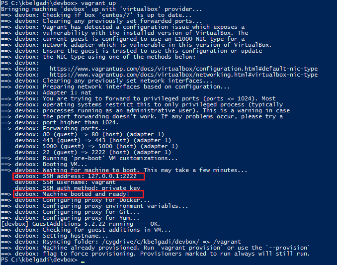

Pour arrêter la VM:
```shell
vagrant halt
```

Pour supprimer définitivement la VM:
```shell
vagrant destroy
```

### Accès à la VM en SSH

Une fois la VM démarrée, entrer la commande Putty suivante à partir d'un terminal cmd.exe Windows pour vous connecter en SSH à la VM:

```shell
set VAGRANT_PRIV_KEY=<Absolute path to the vagrant PPK private key>

start putty -ssh vagrant@localhost -P 2222 -i  %VAGRANT_PRIV_KEY%
```

	NB: VAGRANT_HOME ci-dessus, correspond au répertoire contenant le fichier Vagrantfile et le répertoire .vagrant

### Monter un tunnel SSH vers la VM

Il est possible d'utiliser Putty pour ouvrir un Tunnel SSH vers des services s'exécutant sur la machine virtuelle.
Pour ce faire, les commandes suivantes doivent être exécutée sur un terminal cmd.exe Windows:

```shell
set VAGRANT_PRIV_KEY=<Absolute path to the vagrant PPK private key>
set REMOTE_SERVICE_IP=<IP of the remote service running on K8s>
set REMOTE_SERVICE_PORT=<Port of the remote service running on K8s>
set LOCAL_SERVICE_PORT=<Local port to the service. e.g. the one that will be used on the local web browser>

start putty -ssh vagrant@localhost -P 2222 -i  %VAGRANT_PRIV_KEY% -L %LOCAL_SERVICE_PORT%:%REMOTE_SERVICE_IP%:%REMOTE_SERVICE_PORT%
```

Les commandes suivantes permettent par exemple d'accéder via http://localhost:8084 sur le PC, à un Pod K8s exposant un port 8080 via son service associé dont la clusterIP est 10.98.93.27:

```shell
set VAGRANT_PRIV_KEY=<Absolute path to the vagrant PPK private key>
set REMOTE_SERVICE_IP=10.98.93.27
set REMOTE_SERVICE_PORT=8080
set LOCAL_SERVICE_PORT=8084

start putty -ssh vagrant@localhost -P 2222 -i  %VAGRANT_PRIV_KEY% -L %LOCAL_SERVICE_PORT%:%REMOTE_SERVICE_IP%:%REMOTE_SERVICE_PORT%
```

	NB: Il est possible de monter plusieurs tunnels SSH à condition que les ports locaux soient différents (Ex: localhost:8081, localhost:8082...)

### Installation d'un composant dans la VM

# Annexes

## Accès à la VM en SSH via Putty en mode graphique

#### Conversion de la clé privée SSH en clé Putty (*.ppk)

Ouvrir PuttyGen:

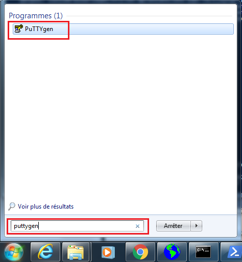

Charger la clé privée SSH générée par Vagrant:

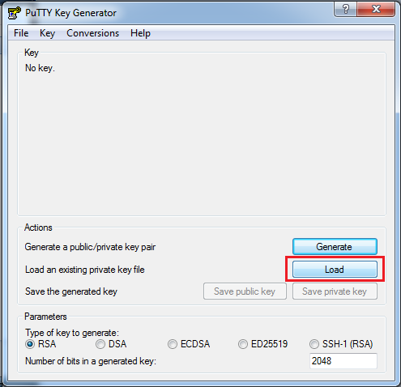

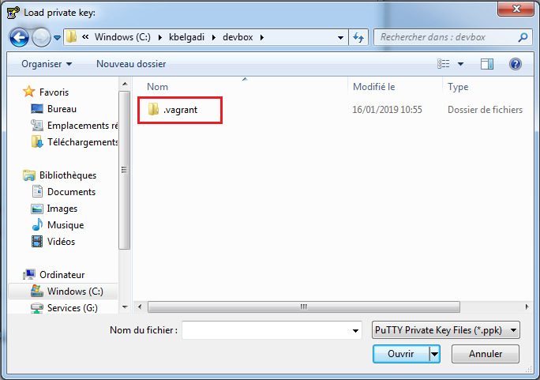

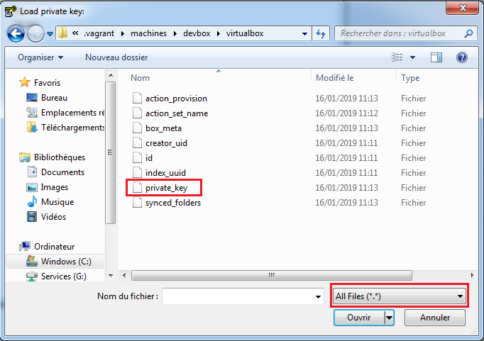

Convertir la clé SSH en clé Putty (*.ppk)

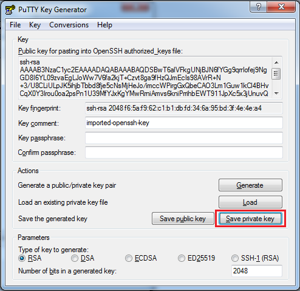

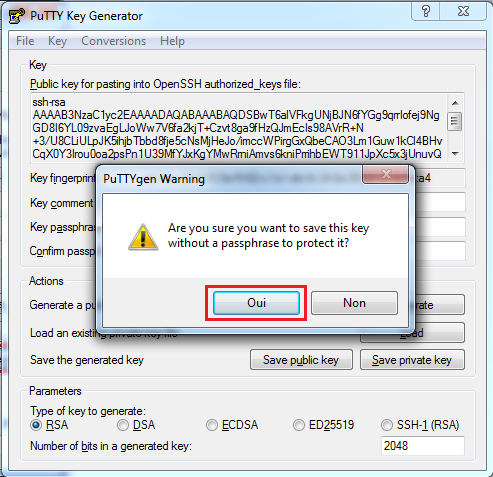

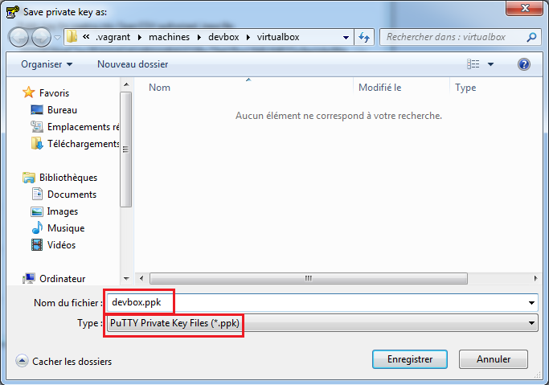

#### Accès en SSH via Putty à la VM Vagrant devbox

Ouvrir Putty:

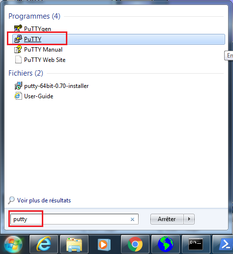

Configurer la clé *.ppk précédemment créée:

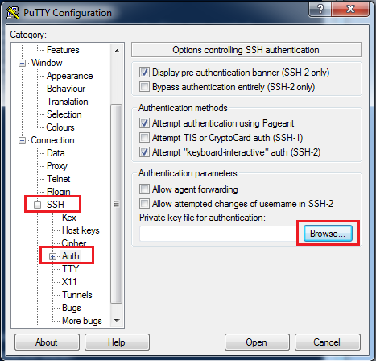

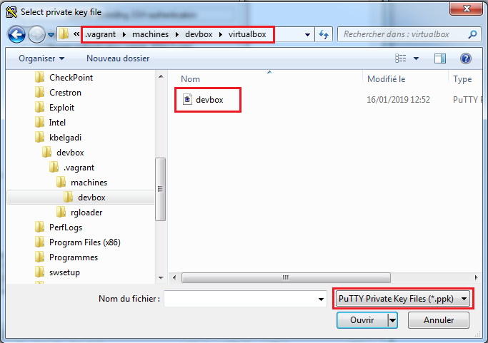

Configurer les propriétés de la session SSH: 

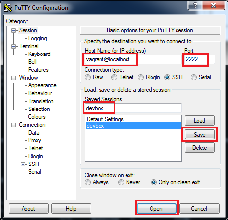

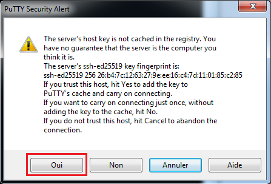


